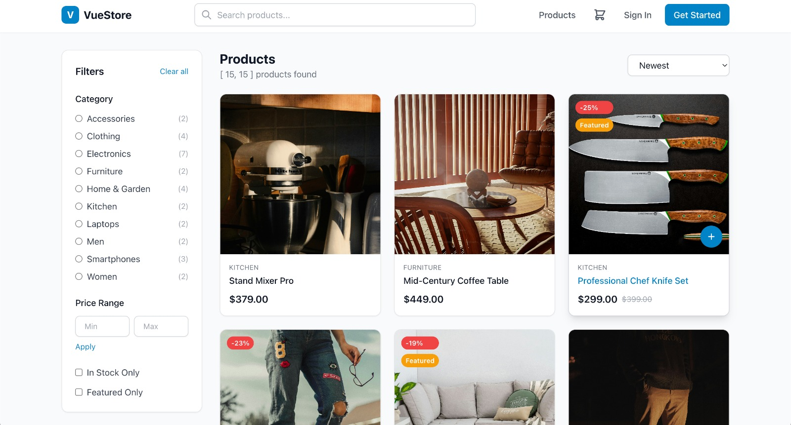
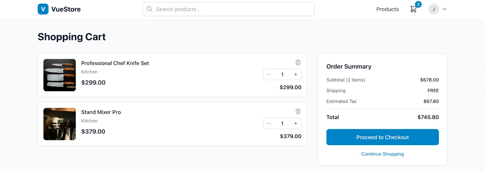
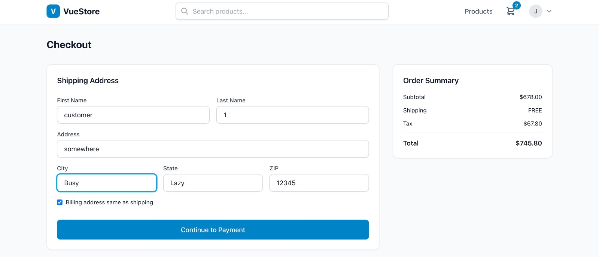

# VueStore

**Full e-commerce frontend — product browsing, cart, wishlist, and role-based auth, built on Vue 3.**

[](https://vuestore-tgsz.vercel.app/)

[View Live Site](https://vuestore-tgsz.vercel.app/) · Backend repo: [vuestore-api](https://github.com/ShoaibRana888/vuestore-api)

<!--
Desktop screenshots, 1440x900 (16:10), PNG, cropped to the app (no browser chrome).
-->

| | |
|---|---|
| **Product listing** |  |
| **Shopping cart** |  |
| **Cart & checkout** |  |

## Overview

VueStore is the customer-facing storefront for a complete e-commerce platform: browsing and filtering products by category, a shopping cart and wishlist, user authentication with role-based access, and Stripe-ready checkout. It talks to a separate Laravel 12 API ([vuestore-api](https://github.com/ShoaibRana888/vuestore-api)) for products, orders, and auth.

## Features

- Product browsing with category filtering
- Shopping cart and wishlist
- User authentication with role-based access control
- Stripe integration for checkout
- Admin-facing views for managing products, categories, and orders (via the API's admin routes)

## Tech stack

- **Framework:** Vue 3 (Composition API) + Vite + TypeScript
- **State:** Pinia
- **Routing:** Vue Router
- **Styling:** Tailwind CSS
- **Payments:** Stripe.js
- **HTTP:** Axios
- **Backend:** [vuestore-api](https://github.com/ShoaibRana888/vuestore-api) — Laravel 12

## Getting started

```bash
git clone https://github.com/ShoaibRana888/vuestore.git && cd vuestore
npm install
cp .env.example .env
```

Set in `.env`:

| Variable | Purpose |
|---|---|
| `VITE_API_URL` | Base URL of the [vuestore-api](https://github.com/ShoaibRana888/vuestore-api) backend, e.g. `http://localhost:8000/api/v1` |
| `VITE_STRIPE_PUBLIC_KEY` | Stripe publishable key |
| `VITE_APP_NAME` | Display name shown in the UI |

```bash
npm run dev   # → http://localhost:5173
```

Requires [vuestore-api](https://github.com/ShoaibRana888/vuestore-api) running for data — see that repo for setup.

## Contact

**Shoaib Rana** — [shoaib.rana888@gmail.com](mailto:shoaib.rana888@gmail.com) · [Portfolio](https://portfolio-pied-two-34.vercel.app/) · [GitHub](https://github.com/ShoaibRana888)
